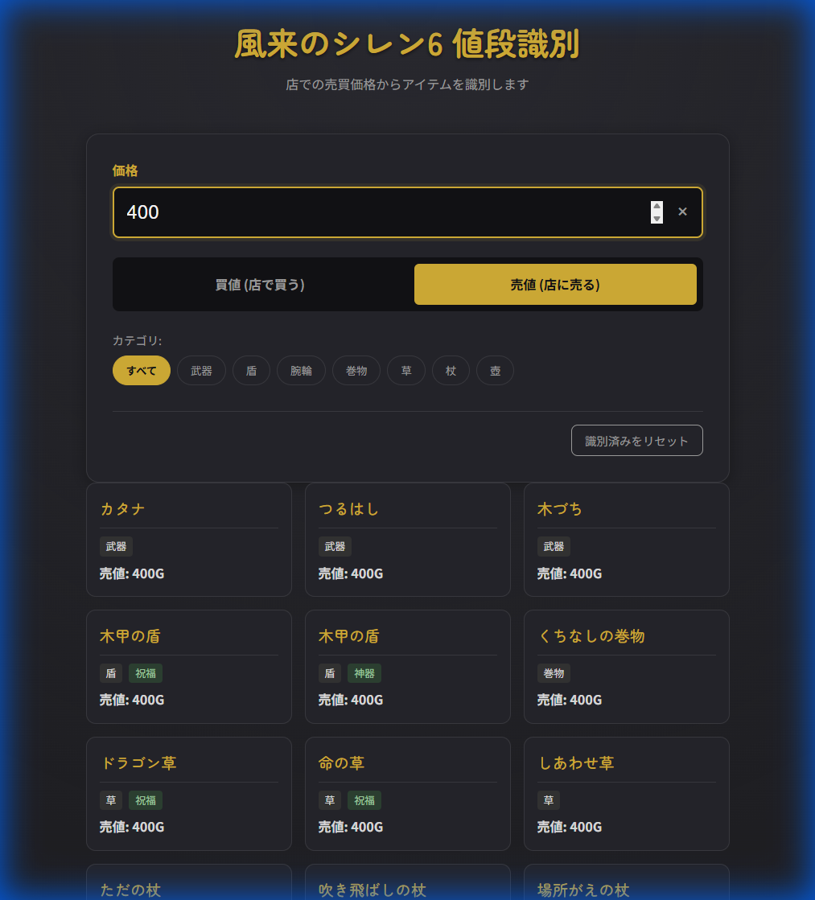

# 風来のシレン6 値段識別ツール (Shiren 6 Price Identifier)

風来のシレン6のアイテムを、店での売買価格から識別するためのWebツールです。

[👉 アプリを開く (Open App)](https://inara-.github.io/Siren6Support/)



## 機能 (Features)

*   **値段による識別**: アイテムの価格を入力することで、候補となるアイテムを一覧表示します。
*   **売値・買値の切り替え**: 店で「買う」時の値段と、店に「売る」時の値段の両方に対応しています。（デフォルトは「売値」）
*   **カテゴリフィルタ**: 武器、盾、腕輪、巻物などのカテゴリで絞り込みが可能です。
*   **状態の判別**: 通常価格だけでなく、呪い（0.87倍）、祝福（2倍）、神器（2倍）の価格にも対応しており、該当する状態を表示します。
*   **識別済みチェック**: 判明したアイテムをクリックすることで「識別済み」としてマークできます。この状態はブラウザに保存され、次回アクセス時も保持されます。
*   **リセット機能**: 識別済みの状態を一括でリセットできます。

## 使い方 (Usage)

1.  **価格を入力**: 識別したいアイテムの価格を入力フォームに入力します。
2.  **取引タイプを選択**: 「買値」か「売値」かを選択します。
3.  **候補を確認**: 条件に一致するアイテムが表示されます。
4.  **絞り込み**: 必要に応じてカテゴリボタンを押して絞り込みます。
5.  **識別済みマーク**: アイテムが判明したら、カードをクリックして「識別済み」にします（ハイライトされます）。

## インストール (Installation)

このプロジェクトは静的なHTML/CSS/JSで構成されています。
リポジトリをクローンし、`index.html` をブラウザで開くだけで使用できます。

```bash
git clone https://github.com/inara-/Siren6Support.git
cd Siren6Support
# index.html をブラウザで開く
```
